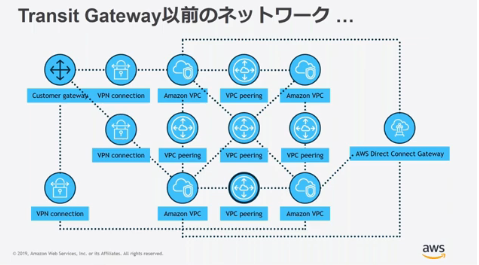
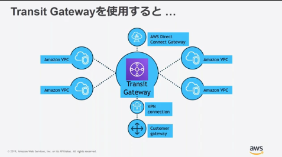
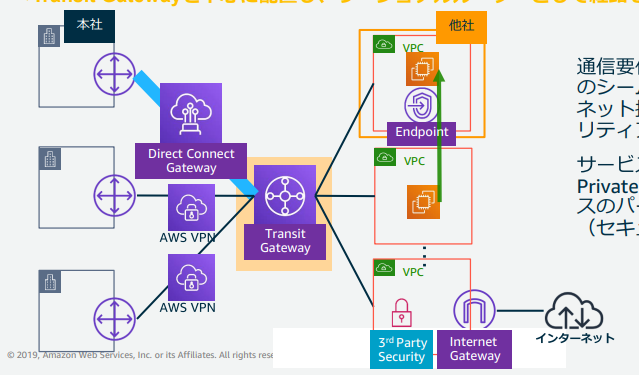

## AWS Transit Gatewayについて

リージョナルゲートウェイサービスになる。
リージョンごとに存在する。

大規模、数戦のVPC、VPN、Direct Connectを接続可能

VPC Peeringを利用するとメッシュでそれぞれ設定する必要があった。

本サービスを利用することで同一のtransit gatewayを利用しているVPC同士が
複雑に設定することなしに通信することが実現できる。

以下の図の通り、オンプレ拠点が追加された場合もDirect Connectを経由でTransit Gatewayにアクセスすることで利用することが可能。

ECMPルーティングとは

等価コスト マルチパス (ECMP)ルーティングプロトコル。
等コストの経路が複数存在するときにトラフィックを振り分ける機能。

基本的な動作は
同じ宛先に対して複数の党コストな経路が存在する。
パケットのヘッド情報(ポート番号や宛先IPなど)をもとにハッシュ値を計算。
そのハッシュ値をもとにどの経路にパケットを転送するかを決定する。

メリットとしては
ネットワークの帯域幅を効率的に利用することができる。
特定リンクへの負荷集中を防ぐ。
冗長性の向上

Per Packet→パケット毎に経路を決定する。
Per Flow→フロー事に経路を決定
Per Destination→宛先ごとに経路を決定する。

このような実装方法がよくあるらしい。

