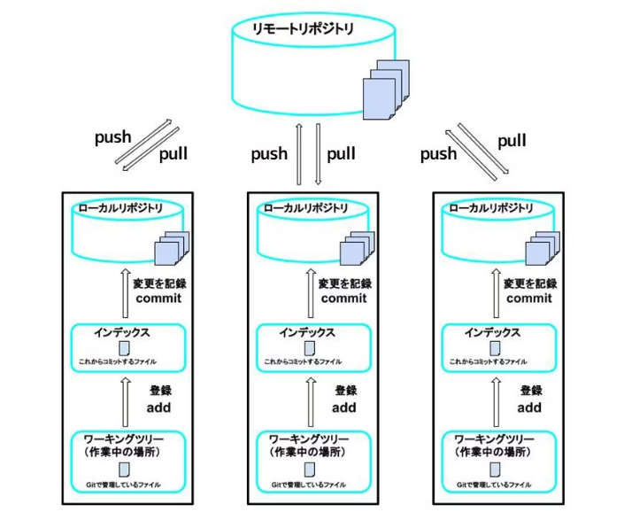

# Ｇit用語集

### GitHub
GItのリポジトリをホスティングするサービス。
変更履歴をオンライン上で扱うことができる。同様のサービスとしてGitLabやzBackLogやGitbucketなどがあります。

### Gitの構造

###リポジトリ
ファイルやディレクトリの状態を記録する場所。
システムの開発プロジェクトに関連するデータの一元的な保管場所を意味します。

### ローカルリポジトリ
ローカルで保存している自分一人で編集するリポジトリのことを指します。

### リモートリポジトリ
ローカル以外の他のコンピュータもしくはサービスに保存された「みんなで使うリポジトリ」です。
例:GitHub

### クローン(clone)
リモートリポジトリの内容を自分のローカル環境(自分のPC上)にコピーすること。
例: git clone <リモートリポジトリのURL>

### フォーク(fork)
他の人のリモートリポジトリを自分のリモートリポジトリにコピーすること。

